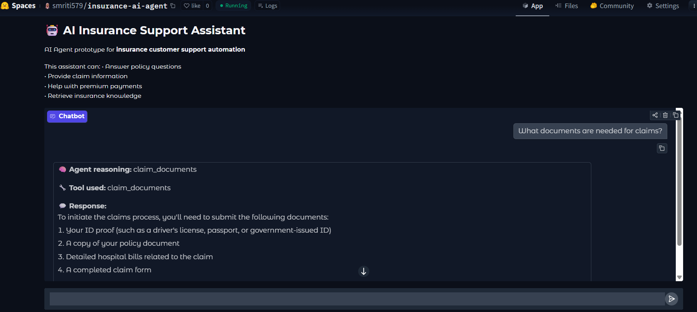

# 🤖 AI Insurance Agent (RAG + Tool-Based AI System)

An **AI-powered insurance support assistant** built using **Retrieval-Augmented Generation (RAG)** and **tool-based agent architecture**.

The system can answer customer queries about insurance policies, claims, premium payments, and general insurance information by combining **vector search, knowledge retrieval, and LLM-based response generation**.

---

# 🚀 Live Demo

HuggingFace Space:
[https://huggingface.co/spaces/smriti579/insurance-ai-agent](https://huggingface.co/spaces/smriti579/AI-Insurance-Agent)

---

# 📸 Application Screenshot



---

# 🧠 Project Overview

Customer support teams in insurance companies often handle repetitive queries such as:

* Checking policy status
* Understanding claim requirements
* Payment and premium questions
* Updating customer details

This project demonstrates how **AI agents can automate such support workflows** using:

* **Vector search (FAISS)**
* **Knowledge retrieval**
* **LLM response generation**
* **Agent decision-making**

The system retrieves relevant information from a knowledge base and uses an LLM to generate structured responses for users.

---

# ⚙️ Architecture

User Query
↓
Agent Decision System
↓
Tool Execution OR Knowledge Retrieval
↓
FAISS Vector Search
↓
LLM Response Generation (Groq)
↓
Gradio Interface Response

---

# 🔎 Retrieval-Augmented Generation (RAG)

The system implements **RAG** to improve accuracy and reduce hallucination.

Steps:

1. Knowledge base is converted into **vector embeddings**
2. Embeddings are stored in **FAISS vector index**
3. User query is embedded into vector form
4. FAISS retrieves the **most relevant knowledge chunks**
5. Retrieved context is passed to the **LLM**
6. LLM generates the final answer

---

# 🧠 Agent System

The AI assistant behaves like an **AI agent** by deciding which tool to use based on the user query.

Available tools:

| Tool                 | Function                            |
| -------------------- | ----------------------------------- |
| Policy Status Tool   | Returns policy information          |
| Claim Document Tool  | Provides required claim documents   |
| Premium Payment Tool | Explains payment process            |
| Retriever            | Uses FAISS to search knowledge base |

This architecture demonstrates **tool-based AI agents used in real enterprise AI systems**.

---

# 🧰 Technologies Used

| Technology            | Purpose             |
| --------------------- | ------------------- |
| Python                | Backend development |
| Groq API              | LLM inference       |
| FAISS                 | Vector database     |
| Sentence Transformers | Text embeddings     |
| Gradio                | Web UI              |
| HuggingFace Spaces    | Deployment          |

---

# 📂 Project Structure

```
insurance-ai-agent
│
├── app.py
├── requirements.txt
├── README.md
└── screenshots
     └── app_demo.png
```

---

# 🖥️ Running Locally

Install dependencies:

```
pip install -r requirements.txt
```

Set Groq API key:

```
export GROQ_API_KEY=your_api_key
```

Run the application:

```
python app.py
```

---

# 🌟 Features

✔ Retrieval-Augmented Generation (RAG)
✔ AI Agent decision system
✔ Vector similarity search with FAISS
✔ LLM-based response generation
✔ Interactive Gradio interface
✔ Deployable on HuggingFace Spaces

---

# 🔮 Future Improvements

* Real insurance database integration
* Multi-agent workflow system
* Conversation memory
* Claim status API integration
* Customer authentication system

---

# 👩‍💻 Author

Smriti Mahajan
B.Tech Artificial Intelligence – Amity University

AI / ML | LLM Applications | Intelligent Systems
